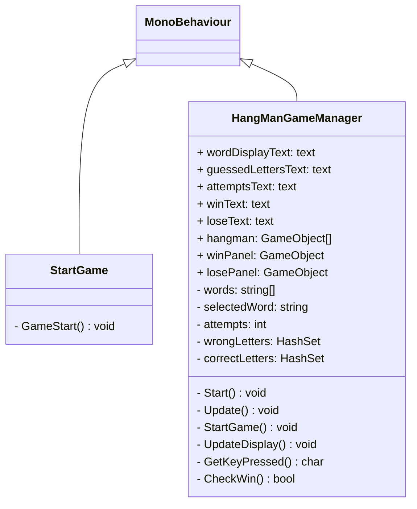

# 12-Hangman-hjauch

```mermaid
classDiagram
    MonoBehaviour <|-- StartGame
    MonoBehaviour <|-- HangManGameManager
   
    class StartGame {
        - GameStart() void
    }
    class HangManGameManager {
        + wordDisplayText: text
        + guessedLettersText: text
        + attemptsText: text
        + winText: text
        + loseText: text
        + hangman: GameObject[]
        + winPanel: GameObject
        + losePanel: GameObject
        - words: string[]
        - selectedWord: string
        - attempts: int
        - wrongLetters: HashSet
        - correctLetters: HashSet
        - Start() void
        - Update() void
        - StartGame() void
        - UpdateDisplay() void
        - GetKeyPressed() char
        - CheckWin() bool
    }
```
